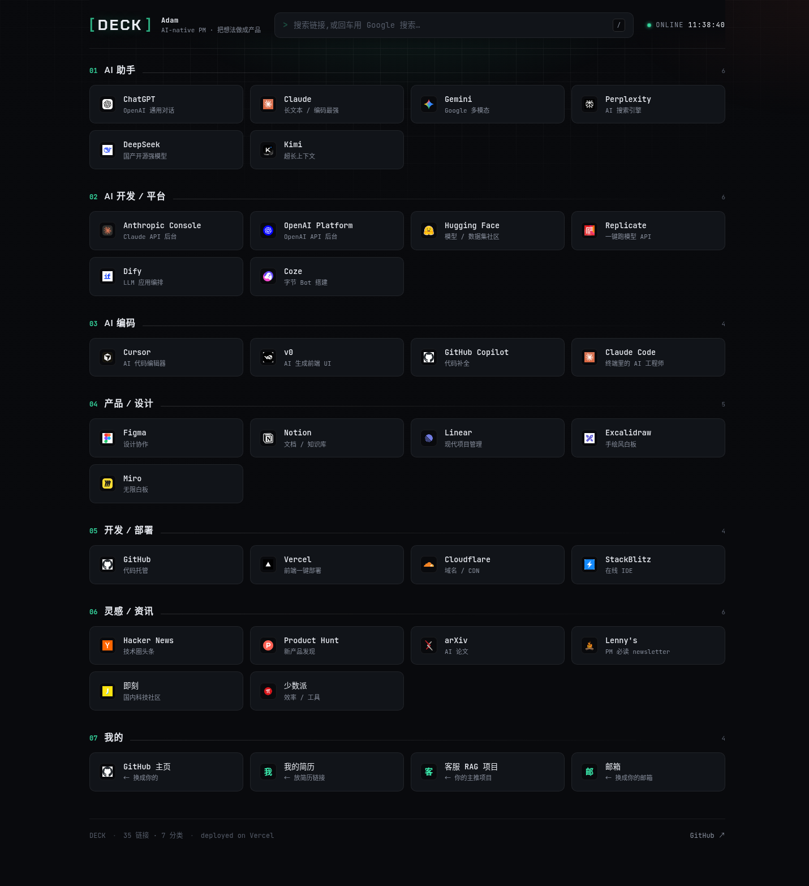

# DECK · 个人导航站

一个「终端任务控制台」风格的暗色导航站 —— 把你常用的 AI 工具、产品和链接收进一个有辨识度的起始页。纯静态、零依赖、零构建,推到 GitHub 后用 Vercel 一键部署。



## ✦ 特性

- **数据驱动** —— 所有链接放在 `links.js` 一个文件里,增删链接只改这一个文件
- **终端控制台 UI** —— 冷炭黑 + 电光薄荷绿,`Chakra Petch` / `JetBrains Mono` 字体,背景网格 + 光晕 + 扫描线
- **即时搜索** —— 输入实时过滤;搜不到时回车直接用搜索引擎查
- **键盘党友好** —— 按 `/` 秒聚焦搜索框,`Esc` 清空
- **自动图标** —— 根据网址自动抓取 favicon,不用手动找图
- **响应式** —— 手机、平板、桌面都好看
- 纯 HTML / CSS / 原生 JS,**无框架、无构建步骤**

## ✦ 改成你自己的

打开 `links.js`,改两处即可:

```js
// 1) 站点信息
const SITE = {
  brand: "DECK",                       // 左上角站名
  owner: "你的名字",
  tagline: "一句话标语",
  github: "https://github.com/你的用户名",
  searchEngine: { name: "Google", url: "https://www.google.com/search?q=" },
};

// 2) 链接分类(每个分类一组,每个链接 name / url / desc)
const CATEGORIES = [
  {
    name: "AI 助手",
    items: [
      { name: "Claude", url: "https://claude.ai", desc: "长文本 / 编码最强" },
      // ...继续加
    ],
  },
  // ...继续加分类
];
```

想换配色?打开 `styles.css` 顶部的 `:root`,改 `--accent`(主强调色)等变量即可。

## ✦ 本地预览(可选)

任选其一在项目目录下起个本地服务器:

```bash
python3 -m http.server 5173
# 或
npx serve .
```

然后浏览器打开 `http://localhost:5173`。

## ✦ 部署到 Vercel

1. 在 GitHub 新建一个空仓库(**不要**勾选 "Add a README",因为本地已有)。
2. 在本项目目录里关联并推送:
   ```bash
   git remote add origin https://github.com/你的用户名/仓库名.git
   git branch -M main
   git push -u origin main
   ```
3. 打开 [vercel.com](https://vercel.com),用 GitHub 登录 → **Add New → Project** → 选中这个仓库。
4. Framework Preset 选 **Other**(纯静态,无需任何配置),点 **Deploy**。
5. 几十秒后拿到一个 `xxx.vercel.app` 网址。之后每次 `git push` 到 `main`,Vercel 会自动重新部署。

> 想用自己的域名:在 Vercel 项目的 **Settings → Domains** 里添加即可。

## ✦ 目录结构

```
.
├── index.html     # 页面结构
├── styles.css     # 样式(改配色 / 风格看这里)
├── links.js       # ← 你的链接数据(平时只改这个)
├── app.js         # 渲染与交互逻辑
├── favicon.svg    # 站点图标
└── README.md
```

## ✦ 技术栈

原生 HTML / CSS / JavaScript · Google Fonts · Google favicon 服务 · Vercel 静态托管
